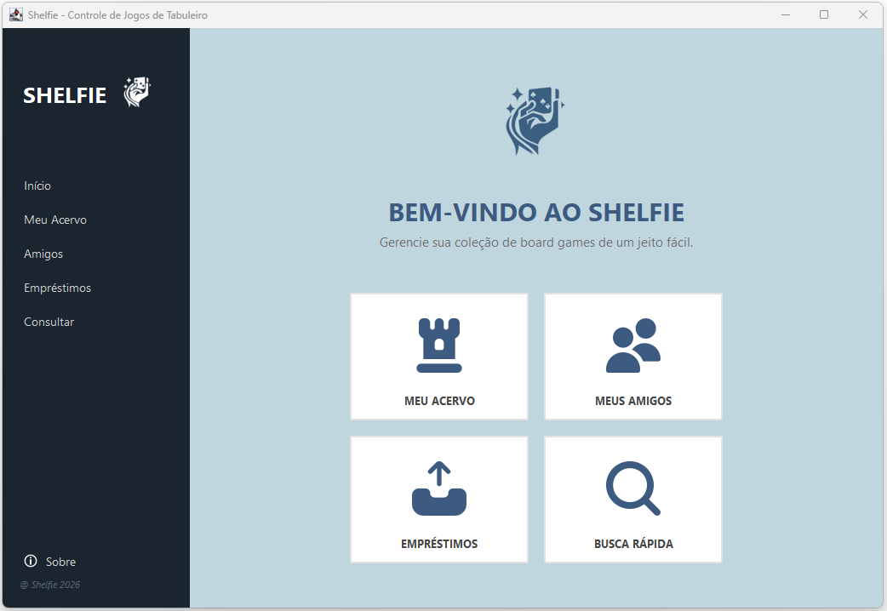
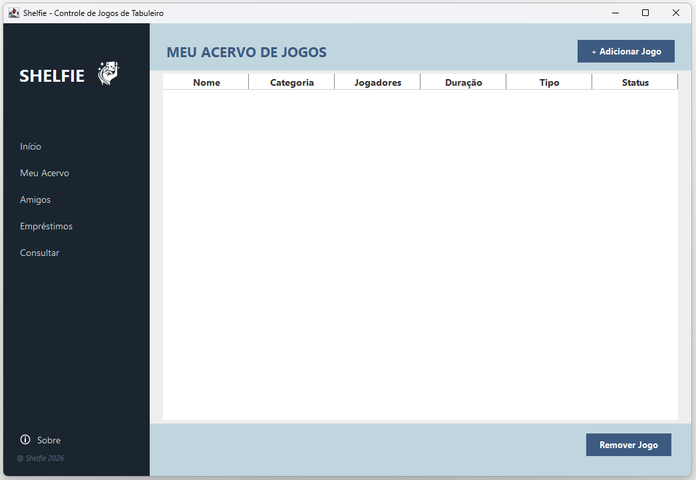
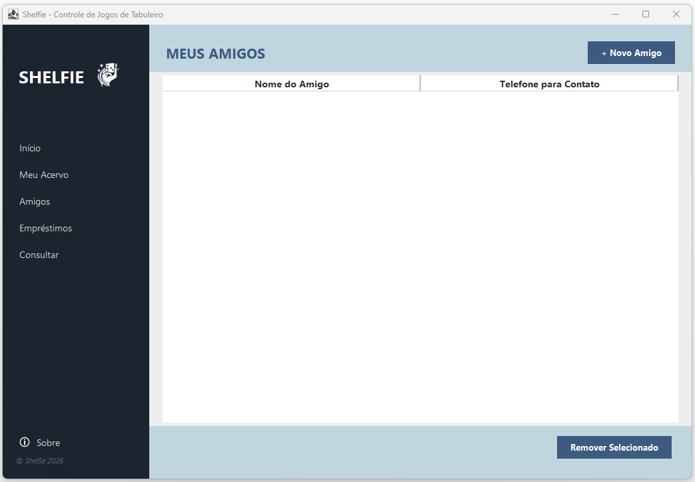
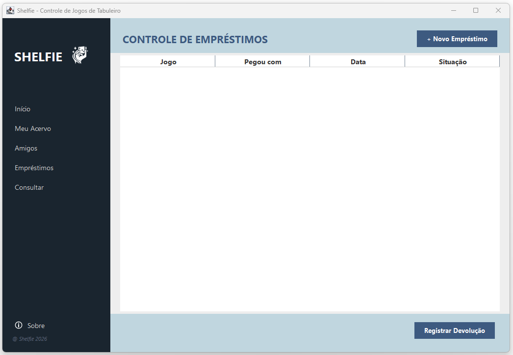
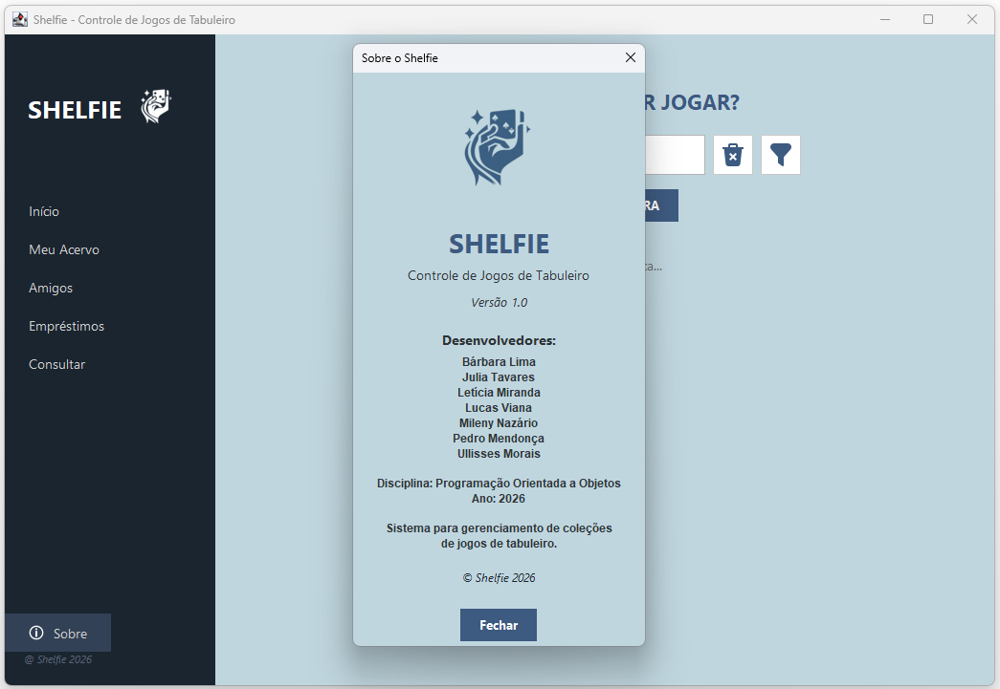

# 🎲 Shelfie

Sistema para gerenciamento de coleções de jogos de tabuleiro desenvolvido em Java utilizando Swing e os princípios da Programação Orientada a Objetos.

---

## 📖 Sobre o Projeto

O Shelfie é uma aplicação desktop criada para auxiliar usuários no gerenciamento de suas coleções de jogos de tabuleiro.

O sistema permite cadastrar jogos, gerenciar amigos, controlar empréstimos e realizar consultas rápidas, proporcionando uma organização simples e eficiente da coleção.

Este projeto foi desenvolvido como atividade acadêmica da disciplina de Programação Orientada a Objetos.

---

## ✨ Funcionalidades

### 🎮 Gerenciamento de Jogos

- Cadastro de jogos
- Edição de informações
- Remoção de registros
- Visualização da coleção

### 👥 Gerenciamento de Amigos

- Cadastro de amigos
- Atualização de informações
- Exclusão de registros

### 🤝 Controle de Empréstimos

- Registro de empréstimos
- Associação de jogos a amigos
- Acompanhamento dos empréstimos realizados

### 🔍 Consulta de Jogos

- Busca rápida por jogos cadastrados
- Visualização facilitada das informações

---

## 🖥️ Interface

O sistema possui interface gráfica desenvolvida com Java Swing, seguindo uma identidade visual própria e organizada.

### Principais telas

- Home
- Meu Acervo
- Amigos
- Empréstimos
- Consulta
- Sobre

---

## 🛠️ Tecnologias Utilizadas

- Java
- Java Swing
- Eclipse IDE
- Programação Orientada a Objetos (POO)

---

## 📂 Estrutura do Projeto

```text
Shelfie/
│
├── assets/
│   ├── logoblue.png
│   ├── logowhite.png
│   ├── games_icon.png
│   ├── friends_icon1.png
│   ├── deal_icon.png
│   └── search_icon.png
│
├── src/
│   ├── controller/
│   ├── model/
│   └── view/
│
├── README.md
└── .gitignore
```

---

## 🚀 Como Executar

### Pré-requisitos

- Java JDK 8 ou superior
- Eclipse IDE (ou outra IDE compatível)

### Passos

1. Clone o repositório:

```bash
git clone https://github.com/SEU-USUARIO/Shelfie.git
```

2. Abra o projeto no Eclipse.

3. Certifique-se de que a pasta `assets` esteja na raiz do projeto.

4. Execute a classe:

```text
view.TelaPrincipal
```

---

## 👨‍💻 Equipe de Desenvolvimento

- Bárbara Lima
- Julia Tavares
- Letícia Miranda
- Lucas Viana
- Mileny Nazário
- Pedro Mendonça
- Ullisses Morais

---

## 🎓 Informações Acadêmicas

**Disciplina:** Programação Orientada a Objetos

**Projeto:** Shelfie – Sistema de Gerenciamento de Jogos de Tabuleiro

**Ano:** 2026

---

## 📸 Capturas de Tela

### Tela Inicial



### Meu Acervo



### Amigos



### Empréstimos



### Consulta


### Sobre



---

## 📄 Licença

Este projeto foi desenvolvido exclusivamente para fins acadêmicos.

© Shelfie 2026
